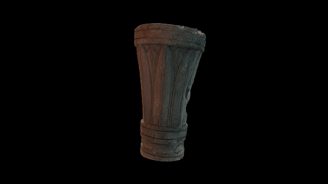

 

# A 3D model of an architectural element

3D data for recreation of a British Museum object.

Experimental scan, object in very close proximity to corner of a gallery wall (inches). Will try to improve this with a different camera.
Limestone capital from a column, perhaps part of a funeral or votive stele; narrow circular base decorated with mouldings (a flat fillet separating two rounded mouldings above and below, separated by a carinated band: the upper fillet has an incised zig-zag); the stele splays outwards as it rises: two rows of superimposed acanthus leaves, the outer row has rounded tips, the inner row with angular tips; the stele is topped with another set of mouldings, repeating the round and flat patter as on the base; socket in the lower end presumably for attachment to a pillar; traces of red and black paint revealed during cleaning.
Height: 54 centimetres Diameter: 29 centimetres (abacus) 

COL: GAA65528

# LICENSE
The contents of this repository are licensed under CC-BY-NC-SA

# Credits
Photographs and models by Daniel Pett <dpett@britishmuseum.org>, Digital Humanities Lead, British Museum

Copyright Trustees of the British Museum
